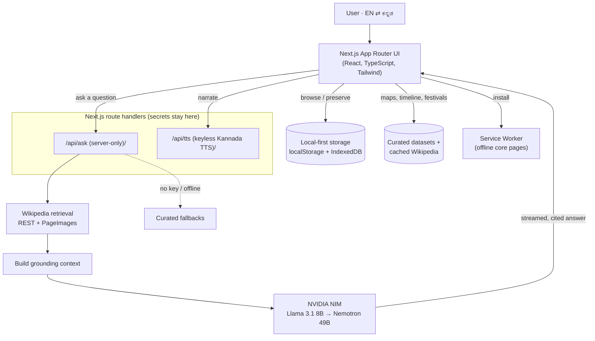

# 🪔 Akkaverse

> A bilingual (English + ಕನ್ನಡ) platform to **preserve, teach, and celebrate**
> Kannada language, history, culture, and heritage.

Akkaverse is a **local-first Next.js** app. It runs **fully open — no login, no
sign-up** — so anyone (or any judge) can use every feature instantly. Your
family archive and original recordings stay private on your own device. An
**AI guide grounded in real Wikipedia sources** answers questions in English or
Kannada, and the entire experience is bilingual.

**Live demo:** https://akkaverse.vercel.app/ · **No credentials needed — just open and use it.**

---

## 🎯 Concept & Impact

- **Problem.** For millions of Kannada families living away from Karnataka,
  culture fades one generation at a time — a grandparent speaks Kannada, a
  parent understands it, a child knows only a few words. An elder's voice,
  blessings, and stories are lost when they are gone.
- **Solution.** Akkaverse begins with *your family*, not a textbook. It lets a
  family preserve an elder's words (blessing, story, song, recipe, advice) in
  Kannada + English, turn any recording into a **language lesson** for the next
  generation, and then explore the wider culture — maps, a cinematic timeline,
  festivals, stories — with an AI guide that never invents history.
- **Target users.** Kannada diaspora families first; then Kannada schools,
  cultural associations, and community oral-history projects.

A full write-up (concept, roadmap, MVP scope, technical deep-dive) is in
[docs/SUBMISSION.md](docs/SUBMISSION.md).

---

## ✨ What's inside

- **Ask Akka (AI guide)** — ask about Karnataka's history, temples, festivals,
  and food in English or Kannada; answers are grounded in Wikipedia with source
  links.
- **Roots & Voice Legacy** — build a family tree, and preserve an elder's words;
  attach their original recording, then pass a private bilingual lesson to the
  next generation.
- **Explore** — interactive Karnataka district map with cached Wikipedia info &
  photos.
- **Timeline** — a cinematic scroll through 2,500 years of Karnataka.
- **Festivals & Stories** — immersive, curated heritage experiences.
- **Learn** — structured Kannada lessons with read-aloud.
- **Quiz** — test your Karnataka knowledge.
- **Tools** — in-browser Kannada OCR (private, nothing is uploaded).

Everything is bilingual and works in English, ಕನ್ನಡ, or both at once.

---

## 🏗️ Architecture



---

## 🧠 How it Works (technical deep-dive)

**1. Grounded AI, not a chatbot wrapper.** When you Ask Akka, the request goes
to a **server-only** route (`src/app/api/ask/route.ts`) — the `NVIDIA_API_KEY`
is never exposed to the browser. The route:

1. **Retrieves** relevant context from Wikipedia (REST summary + PageImages)
   for the question (`src/lib/ai/retrieval.ts`).
2. **Grounds** the model by injecting that context and citations into the prompt
   (`src/lib/ai/grounding.ts`), so answers stay factual and show their sources.
3. **Selects a language-aware model** from an NVIDIA NIM pool — a fast default
   (`meta/llama-3.1-8b-instruct`) with a higher-quality fallback
   (`nvidia/llama-3.3-nemotron-super-49b-v1`) — and **streams** the reply.
4. **Degrades gracefully** — if no key is set or the network is down, curated
   fallback experiences still answer.

**2. Local-first & private by default.** There is no account system in this
build. Family data (tree, capsules) lives in `localStorage`; original audio
lives in `IndexedDB` on the device. Nothing is uploaded, so privacy is the
default and the app works offline for previously visited core pages via a
service worker.

**3. Bilingual everywhere.** A single i18n provider (`src/i18n/`) renders every
string in English, Kannada, or both, and the AI can reply in the chosen
language. Kannada narration uses a **keyless** TTS proxy with a browser-voice
fallback.

---

## 🧱 Tech Stack

| Layer    | Technology |
|----------|------------|
| Framework | Next.js (App Router), React, TypeScript |
| Styling   | Tailwind CSS, shadcn/ui |
| AI        | Language-aware **NVIDIA NIM** model pool via a server-only Next.js route + **Wikipedia grounding** |
| Voice     | Keyless synthesized Kannada TTS; optional original recordings |
| OCR       | Tesseract.js (runs in the browser) |
| Data      | Curated local datasets + cached Wikipedia (REST + PageImages) |
| Storage   | `localStorage` (family/capsules) + IndexedDB (original audio) — **local-first, no login** |
| Server    | Next.js route handlers for AI and narration (secrets stay server-side) |
| PWA       | Service worker for offline-capable core pages |
| Deploy    | Vercel |

`NVIDIA_API_KEY` is optional and server-only — without it, curated fallbacks
still work. See [docs/DEPLOY.md](docs/DEPLOY.md) for deployment.

---

## 📁 Repository Structure

```
akkaverse/
├── frontend/            # The Next.js app (everything lives here)
│   ├── src/
│   │   ├── app/         # App Router routes, layouts, API routes (ask, tts)
│   │   ├── components/  # React components (+ ui/ primitives)
│   │   ├── lib/         # Helpers (ai/retrieval, ai/grounding, wiki, speech)
│   │   ├── config/      # Site config (nav, features, metadata)
│   │   ├── data/        # Cached district manifest, curated datasets
│   │   └── i18n/        # English + Kannada translations
│   ├── public/          # Static assets (district images, geojson, photos)
│   └── scripts/         # Build-time helpers (district image cache)
├── docs/                # Deployment guide + submission package
└── README.md
```

---

## 🚀 Getting Started (local)

```bash
cd frontend
npm install
npm run dev
```

Open http://localhost:3000. **No login required.** To enable live Akka answers,
add an `NVIDIA_API_KEY` (see [docs/DEPLOY.md](docs/DEPLOY.md)); without it,
curated fallbacks still work.

Useful scripts (run from `frontend/`):

```bash
npm run dev         # start the dev server
npm run build       # production build
npm run typecheck   # tsc --noEmit
npm run lint        # eslint
```

> On some corporate networks, Node's outbound HTTPS (NVIDIA / Wikipedia) needs
> the system CA: start with `NODE_OPTIONS='--use-system-ca' npm run dev`.

### Refresh district images (optional)

```bash
node --use-system-ca frontend/scripts/cache-districts.mjs
```

---

## ▲ Deploy to Vercel

1. Push this repo to GitHub.
2. In Vercel, **Import** the repository.
3. Set the **Root Directory** to `frontend`.
4. Keep the auto-detected **Next.js** defaults (`npm run build`). Add
   `NVIDIA_API_KEY` to enable live Akka answers.
5. Deploy. 🎉

Full guide, verification steps, and troubleshooting: [docs/DEPLOY.md](docs/DEPLOY.md).

---

## 📜 License

MIT — built as an open, educational heritage project by Mithun Rajanna.
