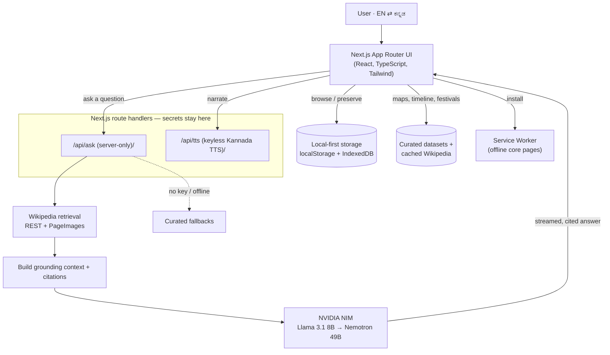

# Akkaverse — Final Submission Package

Bilingual (English + ಕನ್ನಡ) local-first platform to preserve, teach, and
celebrate Kannada heritage.

- **Live demo:** _add your Vercel URL_ — runs **fully open, no login, no test credentials needed**.
- **Repository:** https://github.com/Mithuncoding/akkaverse
- **Video walkthrough (3–5 min):** _add your link_

---

## A. Concept & Impact

### Problem statement
For millions of Kannada families living away from Karnataka, culture is not lost
all at once — it fades **one generation at a time**. A grandparent speaks Kannada
fluently, a parent understands it, and a child may know only a few words. When an
elder passes, their **voice, blessings, proverbs, recipes, and stories** are lost
with them. Existing "heritage" apps are static encyclopedias that store facts but
do nothing to keep a *living* culture alive inside a family.

### Solution overview
Akkaverse starts with **your family, not a textbook**, and expands outward into
the whole culture:

1. **Roots + Voice Legacy** — build a family tree and preserve an elder's words
   (blessing, story, song, recipe, advice) in Kannada + English. Attach their
   original recording, and Akkaverse turns it into a **bilingual language lesson**
   (a phrase to repeat, vocabulary, and a meaning check) for the next generation.
2. **Ask Akka** — an AI guide that answers questions about Karnataka in English
   or Kannada, **grounded in real Wikipedia sources** (shows citations), so it
   never invents history.
3. **Explore, Timeline, Festivals, Stories, Learn, Quiz** — immersive, bilingual
   ways to *experience* the culture: an interactive district map, a cinematic
   2,500-year timeline, festival experiences, and gamified learning.

### Target users
- **Primary:** Kannada diaspora families who want their children to keep the
  language and family memory.
- **Secondary:** Kannada schools and teachers, cultural associations, and
  community oral-history / archival projects.

### Impact
- Converts a passive "someday I'll record grandpa" intention into a **1-minute
  preserve-and-teach loop**.
- **Privacy-first & inclusive:** no account, no upload, works offline for core
  pages — usable by non-technical elders on any device.
- **Language revival at family scale:** every preserved voice becomes a reusable
  Kannada micro-lesson.

---

## B. Technical Architecture

### System design

### Data flow (Ask Akka)
1. User asks a question (EN or KN) → server-only `/api/ask`.
2. `lib/ai/retrieval.ts` pulls relevant Wikipedia summaries + images.
3. `lib/ai/grounding.ts` injects that context + citations into the prompt.
4. A **language-aware NVIDIA NIM** model streams a grounded answer with sources.
5. If no key/network, curated fallbacks answer instead.

### Tech stack
| Layer | Technology |
|---|---|
| Framework | Next.js (App Router), React, TypeScript |
| Styling | Tailwind CSS, shadcn/ui |
| LLMs | NVIDIA NIM pool — `meta/llama-3.1-8b-instruct` (default) → `nvidia/llama-3.3-nemotron-super-49b-v1` (fallback) |
| Grounding | Wikipedia REST + PageImages retrieval |
| Voice | Keyless synthesized Kannada TTS + browser-voice fallback; optional original recordings |
| OCR | Tesseract.js (in-browser, private) |
| Storage | `localStorage` (family/capsules) + IndexedDB (audio) — local-first, no login |
| Offline | Service worker (PWA) |
| Deploy | Vercel |

**Security:** the AI key is server-only (never `NEXT_PUBLIC_`), so it is never
shipped to the browser. No user data leaves the device.

---

## C. Execution Roadmap

### MVP scope (shipped, working today)
- ✅ Bilingual EN/ಕನ್ನಡ UI across every page (instant toggle).
- ✅ Roots family tree + **Voice Legacy** (preserve words, attach recording,
  auto-generate a language lesson, share a text-only family link).
- ✅ **Ask Akka** — Wikipedia-grounded, streamed, cited AI answers in EN/KN with
  graceful fallbacks.
- ✅ Explore (interactive district map), cinematic Timeline, Festivals, Stories,
  Learn, Quiz.
- ✅ In-browser Kannada OCR.
- ✅ Local-first + offline-capable PWA; **no login required**.

### Feasibility
Everything runs on a single Next.js deployment (Vercel) plus one free NVIDIA NIM
key. No database, no auth server, no per-user infra — so it is **cheap to host,
trivial for judges to try, and privacy-safe by construction**.

### Future roadmap (6 months)
1. **Optional** cloud sync + cross-device audio (re-enable accounts as an
   opt-in, RLS-protected layer — currently disabled to keep the app open).
2. **Voice cloning / neural TTS** so a preserved recording can narrate *new*
   text in the elder's own voice (with strict consent).
3. Community oral-history wall with moderation.
4. School mode: teacher dashboards, class assignments from Voice Legacy lessons.
5. Expand grounded retrieval beyond Wikipedia to curated Kannada literary sources.

---

## D. Repository & Docs
- **Source:** https://github.com/Mithuncoding/akkaverse (public).
- **Setup / run locally:** see the root [README](../README.md) and
  [DEPLOY.md](DEPLOY.md).
- **Architecture diagram & "How it Works":** in the [README](../README.md).

## E. Functional Prototype
- **Hosted:** _add Vercel URL_.
- **Test credentials:** **none needed** — the app is fully open (no login).
